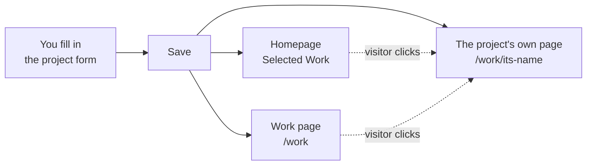
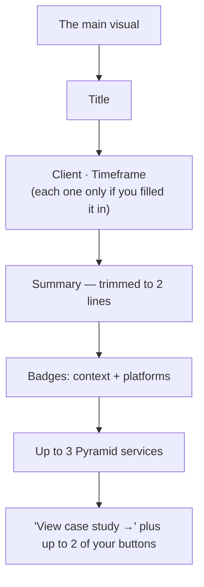
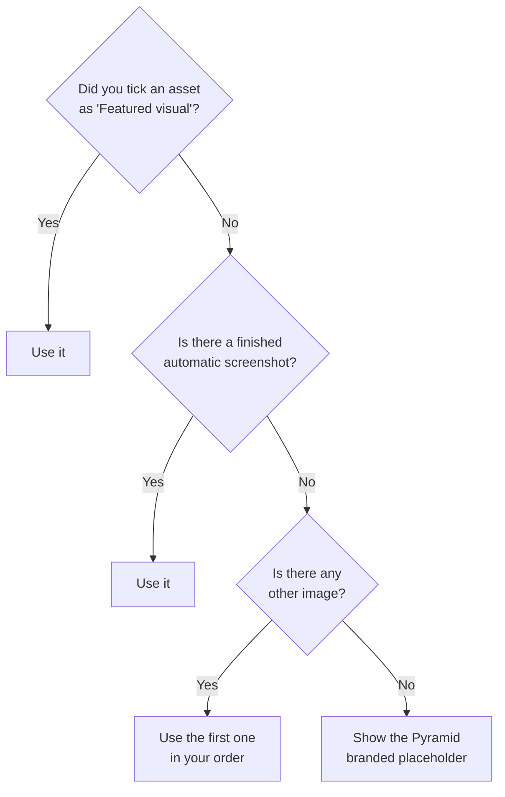
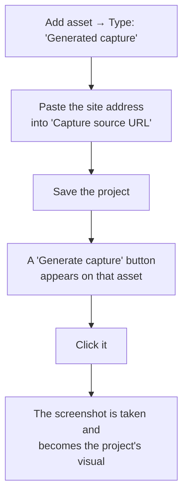
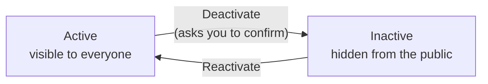

# Projects — How It Works

A guide for whoever adds and edits projects on the Pyramid site.

You do not need to know anything about the code to use this. Everything happens in the admin dashboard, under **Dashboard → Projects**.

---

## 1. The idea in one minute

A **project** is a case study, not a link to a website.

Every project you add gets its own page on the Pyramid site explaining what the work was, what Pyramid did, and what came out of it. Whether the project has a live website, a mobile app, an API, or nothing public at all does not change that — it still gets a proper page.

Three things follow from this:

- **A project does not need a client.** A demo, an experiment, or something Pyramid built for itself is just as valid as client work. The site will never write "Client: none" or leave an awkward gap.
- **A project does not need a live link.** Visitors get the full story on Pyramid's own page.
- **Anything you leave empty simply disappears.** The site never shows "N/A", "Unknown", or an empty row. Skip the industry field and there is no Industry line at all.

---

## 2. What visitors see

Three new things exist on the public site.

### a. The "Work" section on the homepage

A new section between **Services** and **Approach**, showing a handful of hand-picked projects — the first one larger than the rest.

- Only projects you tick **"Show in Selected Work"** appear here.
- It shows at most **6**.
- If more projects exist than the ones shown, the link you set in **Sanity → Home Page → Work section → Link label** appears at the bottom right.
- **Tick none and the whole section vanishes** — no empty heading, no blank space.

A **Work** item in the site menu takes visitors to the work page.

### b. The Work page (`/work`)

Every live project in one list, with a short introduction at the top and the same card design as the homepage. No filters or search — just the full list in your chosen order.

With no projects yet, it shows one quiet line: _"Project case studies are on their way."_

### c. Each project's own page (`/work/name-of-project`)

The real case study, top to bottom:

1. A **← Work** link back to the list
2. A small line of context — e.g. _Demo · Launched_, or _Client work · Maintained · Private_
3. The **title** and **summary**
4. The **buttons** you set up (visit site, app store, source code…)
5. A **facts panel** beside it — client, timeframe, industry, platforms, services, stage, availability
6. The **main visual**
7. Your **overview**, then any **story sections** you added, in your order
8. **Previous / Next project** links
9. A **"Have something like this in mind?"** invitation with a _Start a project_ button

Visitors never hit a dead end at the bottom of a page.

---

## 3. What a card looks like

Cards appear on the homepage and the work page, built from your entries like this:

**Clicking the card opens the Pyramid case study** — never an outside website. Your buttons sit separately, so nobody gets sent off the site by accident.

**About the context badge:** a highlighted chip appears for _Demo_, _Pyramid product_, _Open source_, or _Archived_. Ordinary client work gets no chip — the project stands on its own name rather than being labelled.

---

## 4. The project form, field by field

Open **Dashboard → Projects → + Add Project**. Six blocks.

### Block 1 — Identity

| Field         | Required | What it does                                                                                                                                                           |
| ------------- | -------- | ---------------------------------------------------------------------------------------------------------------------------------------------------------------------- |
| **Title**     | Yes      | The project's name. The card heading and the big page title.                                                                                                           |
| **Slug**      | Yes      | The web address — `beit` becomes `/work/beit`. **Fills in automatically from the title**; you can override it. Must be unique.                                         |
| **Summary**   | Yes      | One or two lines. Used on the card (trimmed to 2 lines), under the page title, and in Google results.                                                                  |
| **Client**    | No       | The client's name. **Leave empty for demos and internal work** — nothing is shown. Write `Confidential client` if you want to say a client exists without naming them. |
| **Industry**  | No       | e.g. _Retail_, _Education_. Facts panel only.                                                                                                                          |
| **Timeframe** | No       | e.g. _2025 — 2026_. Card and facts panel.                                                                                                                              |

> **Changing the slug later** works, but the old web address stops working. Only change it if the project has not been shared anywhere yet.

### Block 2 — Classification

| Field                   | Required          | Options                                                                                                                                                                     |
| ----------------------- | ----------------- | --------------------------------------------------------------------------------------------------------------------------------------------------------------------------- |
| **Origin**              | Yes               | Client work · Pyramid product · Demo · Open source · Project                                                                                                                |
| **Lifecycle**           | Yes               | Concept · In development · Launched · Maintained · Archived                                                                                                                 |
| **Public availability** | Yes               | Public · Limited · Private                                                                                                                                                  |
| **Platforms**           | Yes, at least one | Web · iOS · Android · macOS · Windows · Linux · API · AI · Embedded · Design · Cross-platform · Other                                                                       |
| **Pyramid services**    | Yes, at least one | Product strategy · Product design · UX research · UI design · Brand identity · Mobile / Web / Desktop / Backend development · AI integration · Infrastructure · Maintenance |

These three are deliberately independent — a project can be _Launched_ but _Private_, or a _Demo_ that is fully _Public_.

Two of them change how the site behaves:

- **Lifecycle = Archived** → the badge reads "Archived", and **outdated buttons are hidden**. Only _View source code_ and _Contact Pyramid_ survive, so visitors are never sent to a dead link.
- **Availability** shows in the facts panel unless it is _Public_, which is the obvious default and stays out of the way.

### Block 3 — Showcase media

Click **+ Add asset** for each image, video, or diagram.

| Field                | Notes                                                                                             |
| -------------------- | ------------------------------------------------------------------------------------------------- |
| **Type**             | Image · Generated capture · Device mockup · Video · Animation · Diagram · Embed · Branded graphic |
| **Platform shown**   | Optional — tag a screenshot as the iOS one, for example                                           |
| **Asset**            | Upload a file or paste a link. Max 8 MB; JPEG, PNG, WebP, AVIF or GIF                             |
| **Poster image**     | **Required for video and animation** — the still frame shown before playback                      |
| **Alternative text** | **Required whenever there is an image.** Describe what it shows, for screen readers               |
| **Caption**          | Optional, shown under the main visual                                                             |
| **Featured visual**  | Tick one asset to make it the one used on cards and at the top of the page                        |

Use **↑ ↓** to reorder and **Remove** to delete.

> **Only one asset can be the featured visual.** Ticking a new one unticks the old.

### Block 4 — Actions (buttons)

Entirely optional.

| Field                | Notes                                                                                                                                                      |
| -------------------- | ---------------------------------------------------------------------------------------------------------------------------------------------------------- |
| **Destination type** | Visit website · Open web demo · App Store · Google Play · Download · Watch demo · View source code · Read documentation · Request access · Contact Pyramid |
| **Button label**     | Auto-fills to match the type; edit freely                                                                                                                  |
| **URL**              | Must start with `https://` (or `mailto:` for Contact)                                                                                                      |
| **Primary action**   | Tick one to make it the highlighted button                                                                                                                 |

> **Match the words to the destination.** Never label an App Store link "Live demo" — picking the right type gives you the right wording automatically.
>
> A project with no buttons at all is fine. The card still says _View case study →_.

### Block 5 — Case study

**Overview** is required — the opening paragraphs. Separate paragraphs with a blank line.

Below it, add **story modules** in any order with **+ Add module**:

| Module               | Use it for                                          |
| -------------------- | --------------------------------------------------- |
| Rich text            | Plain paragraphs                                    |
| Full-width media     | One large image                                     |
| Text and media       | Text beside an image (you choose which side)        |
| Image gallery        | Several images together                             |
| Video                | A video with its poster                             |
| Feature list         | Key capabilities, each with an optional description |
| Metrics or results   | Numbers with context — _35%_ / _faster onboarding_  |
| Quote or testimonial | A quote, optionally with who said it                |
| Technology list      | The stack, one item per line                        |
| Diagram              | An architecture or flow picture                     |
| Embed                | YouTube, Vimeo, Loom or Figma only                  |

Each module takes an optional heading, and **↑ ↓** reorder them.

> **Never invent results.** With no real numbers, leave the metrics module out — the section disappears rather than showing something hollow. A qualitative outcome written as text is perfectly good.

### Block 6 — Display

| Field                                     | What it does                                         |
| ----------------------------------------- | ---------------------------------------------------- |
| **Show in Selected Work on the homepage** | Puts this project in the homepage section            |
| **Display order**                         | Lower numbers come first; ties break by newest first |

---

## 5. How the main visual gets chosen

You do not have to upload anything. The site works down this list until it finds something:

The placeholder is a deliberate, tidy Pyramid graphic — **not** a broken image. A project with no pictures still looks finished.

---

## 6. Automatic website screenshots

If a project has a public website, the site can take the screenshot instead of you uploading one. **This never happens by itself** — you ask for it, deliberately, per project. Editorial control comes first.

Worth knowing:

- The button appears only **after** the project is saved, because the asset has to exist first.
- The address is **not** guessed from your "Visit website" button — an action link might point at an app store or a video, so you always set the capture source yourself.
- While a screenshot is being made, the project shows the branded placeholder — never a broken image.
- If a screenshot fails, the **previous picture stays untouched**.

> ⚠️ **Current limitation:** the part that actually takes screenshots is not running on the live server yet. Clicking _Generate capture_ queues the request, but nothing happens until a developer runs it by hand. Until that is set up, **upload an image manually** or accept the branded placeholder. Ask a developer if you need a screenshot generated.

---

## 7. Hiding a project without losing it

There is no delete. You **deactivate**, and it is fully reversible.

Deactivating removes the project from **everywhere at once**: the homepage, the work page, its own page (which becomes "not found"), the previous/next links on other projects, and the list search engines read.

It stays fully visible and editable in the dashboard, marked **Inactive**, so you can fix it up and bring it back whenever you like.

---

## 8. What ends up where

| What you enter  | Card                      | Project page    | Notes                                 |
| --------------- | ------------------------- | --------------- | ------------------------------------- |
| Title           | ✓                         | ✓               |                                       |
| Summary         | ✓ (2 lines)               | ✓               | Also used by Google and link previews |
| Client          | ✓ if filled               | ✓ if filled     | Nothing at all appears when empty     |
| Timeframe       | ✓ if filled               | ✓ if filled     |                                       |
| Industry        | —                         | ✓ if filled     |                                       |
| Origin          | Badge, unless client work | ✓               |                                       |
| Lifecycle       | Badge, only if Archived   | ✓               |                                       |
| Availability    | —                         | ✓ unless Public |                                       |
| Platforms       | ✓ all                     | ✓ all           |                                       |
| Services        | ✓ first 3                 | ✓ all           |                                       |
| Featured visual | ✓                         | ✓ large         |                                       |
| Actions         | ✓ first 2                 | ✓ all           | Hidden for archived projects          |
| Overview        | —                         | ✓               |                                       |
| Story modules   | —                         | ✓ in your order |                                       |

---

## 9. Common situations

**A demo with no client.** Origin _Demo_, Client empty. The card shows a "Demo" chip instead of a client line, and nothing hints that a client is missing.

**Client work you cannot name.** Type `Confidential client` in the Client field. Only write it if you mean it — the site will never put it there for you.

**A private project.** Availability _Private_, and add only material you are allowed to show. Do not add a link visitors cannot open. If there is a genuine way to request access, add a _Request access_ button.

**An old project.** Lifecycle _Archived_. The story stays online, an "Archived" chip appears, and stale buttons are hidden automatically.

**No pictures yet.** Publish anyway. The branded placeholder covers you, and you can add a picture any time.

**Reordering the homepage.** Change the **Display order** numbers — lower comes first.

---

## 10. Rules the site enforces

You will see an error if you try to:

- Save without a title, slug, summary, overview, at least one platform, or at least one service
- Reuse a slug another project already has
- Mark two assets as the featured visual, or two buttons as primary
- Add an image without alternative text
- Add a video or animation without a poster image
- Use a link that does not start with `https://`
- Point an embed at anything other than YouTube, Vimeo, Loom or Figma

Everything else is optional, and leaving it out never breaks a page.
